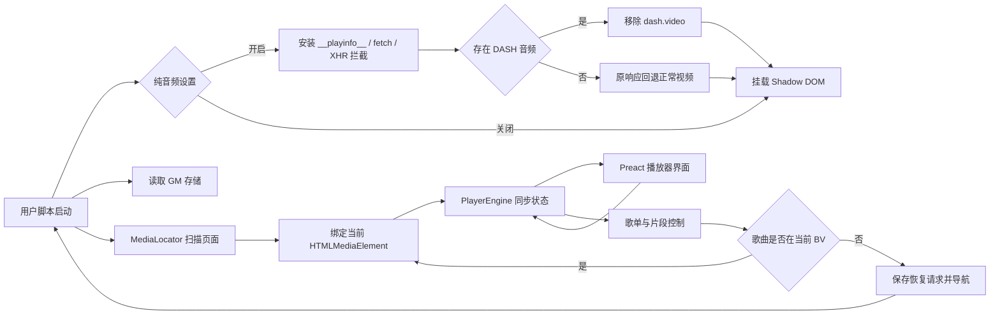

# 架构说明

## 设计边界

脚本只控制 Bilibili 页面已有的媒体元素：

```text
HTMLMediaElement.play()
HTMLMediaElement.pause()
HTMLMediaElement.currentTime
HTMLMediaElement.volume
```

它不会主动请求 `playurl`、解析媒体分片或缓存媒体文件。可选纯音频适配层只改写 Bilibili 页面已经取得的播放清单，在存在可用 DASH 音频时移除 `dash.video`；播放仍由 Bilibili 原生播放器完成。

## 模块

```text
src/
├── app/          Preact UI 和应用状态
├── bili/         页面、媒体元素、元数据和纯音频清单适配
├── core/         类型、ID 和时间工具
├── playback/     队列、片段、跨标签页和播放状态机
├── storage/      GM 存储和数据迁移
├── entry.tsx     Shadow DOM 挂载入口
└── styles.css    隔离后的播放器样式
```

## 运行流程



## 页面适配

`MediaLocator` 同时使用：

- `MutationObserver`：发现媒体元素被创建或替换。
- 定时扫描：补偿 Bilibili 内部异步渲染。
- URL 变化检测：识别 SPA 导航和分P切换。

候选媒体元素按照播放状态、就绪状态、时长和可见面积评分，不依赖 Bilibili 私有播放器对象。

## 纯音频适配

纯音频设置使用独立 GM key，并在 `document-start` 同步读取。关闭时不修改任何页面网络 API；开启时覆盖首屏 `window.__playinfo__`，并对后续普通视频 `playurl` 的 fetch/XHR 响应进行失败开放式改写。

改写器只接受包含非空 `dash.audio` 的已知响应结构。`durl`、未知结构和异常响应保持原样，运行状态切换为回退并恢复视频可见。成功后页面级 CSS 只隐藏 `<video>` 画面，不影响播放器控制条；带宽和解码节省来自不再向播放器提供视频分片地址，而不是 CSS。

开关两种方向都需要整页重载，让 Bilibili 重建 MSE 缓冲区。普通播放用 `t` 参数恢复整数秒进度，歌单播放继续使用现有 `PlaybackSnapshot` 保存精确位置。

## 持久化

数据通过以下 GM API 保存：

```text
GM_getValue
GM_setValue
GM_addValueChangeListener
GM_removeValueChangeListener
```

数据结构包含版本号，后续字段变化应在 `storage/schema.ts` 中增加迁移，不能直接破坏旧歌单。

纯音频开关是启动期偏好，使用独立的 `bilibili-music-player:audio-only` key，不进入歌单数据结构。

播放进度最多每十秒保存一次，并在 `pagehide` 时补充保存，避免高频持久化写入。

## 跨视频与跨标签页

不同 BV 的歌曲通过保存 `resumeRequested` 后导航到对应视频页。新页面定位媒体元素后恢复片段起点并尝试播放。

`BroadcastChannel` 用于播放权声明。当另一个 Bilibili 标签页开始播放时，当前标签页自动暂停，避免两个页面同时出声。

## 后续扩展点

收藏夹和合集应放入独立 `sources/` 适配层，转换为统一的 `Track`，不能让 Bilibili 接口字段直接进入播放核心。
